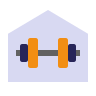

# HomeGym - Sito E-commerce di Attrezzi Sportivi e per la Palestra



Benvenuti in HomeGym, il tuo negozio online di attrezzi sportivi e per la palestra. Questo progetto è stato sviluppato come parte del corso di Tecnologie Software per il Web presso l'Università degli Studi di Salerno 👨🏻‍🎓.

## Descrizione

HomeGym è un sito e-commerce che offre una vasta selezione di attrezzi sportivi e per la palestra 🏋🏻. Gli utenti possono sfogliare e acquistare prodotti, visualizzare dettagli, aggiungere articoli al carrello e completare il processo di acquisto.

## Tecnologie Utilizzate

- HTML
- CSS
- Javascript
- Ajax
- Java (Servlet)
- Apache Tomcat

## Funzionalità Principali

- Visualizzazione e ricerca di prodotti
- Dettagli del prodotto e recensioni degli utenti
- Aggiunta e rimozione di articoli dal carrello
- Completa il processo di acquisto
- Gestione dell'inventario

## Requisiti di Sistema

- Web browser moderno con supporto JavaScript abilitato
- Server web compatibile con Java Servlet (ad esempio, Apache Tomcat)

## Installazione

1. Clonare il repository:

```bash
git clone https://github.com/tuo_username/HomeGym.git
```

2. Copiare i file nel tuo server web compatibile con Java Servlet (come Apache Tomcat).
3. Avviare il server web e accedere al sito tramite il tuo browser.

## Contributi

Siamo aperti a contributi dalla community! Se vuoi partecipare allo sviluppo di HomeGym, segui questi passaggi:

1. Fork il repository.
2. Crea un branch per la tua modifica: git checkout -b miglioramento-funzionalita.
3. Commit delle modifiche: git commit -m 'Aggiunta di nuove funzionalità'.
4. Push del branch: git push origin miglioramento-funzionalita.
5. Invia una pull request.

## Autori

- [Matteo Ercolino](https://github.com/matthew-2000) - Sviluppatore e Project Manager
- Jacopo De Dominicis - Sviluppatore

## Licenza

Questo progetto è concesso in licenza sotto la Licenza MIT - consulta il file LICENSE per ulteriori dettagli.

Speriamo che tu trovi HomeGym utile per il tuo progetto. Se hai domande o suggerimenti, non esitare a contattarci.

Grazie per aver scelto HomeGym!
